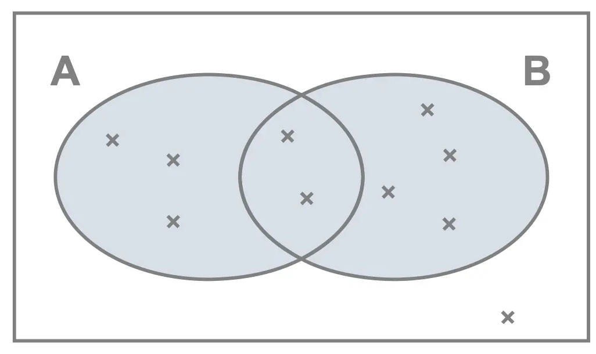

## Probability

Measure defining how commonly we observe different results of a random process. 

ADD COINS HERE

## Objectivist interpretation

If we repeat a random experiment towards infinity, frequencies of different outcomes settle down. These are the probabilities of the outcomes. We can approximate them using a finite sample.

## Subjectivist interpretation

We believe that there is certain ratio at which the outcomes happen. This belief is informed by knowledge of the experiment and experience with the previous outcomes.

## Basic probability algebra

$$P(A \cap B)=P(A)*P(B|A)$$

$$P(A \cup B)=P(A)+P(B)-P(A \cap B)$$

{width=75%}

## Basic probability algebra

If $A$ and $B$ are independent

$$P(A \cap B)=P(A)*P(B)$$

$$P(B|A)=P(B)$$

## Basic probability algebra

If $A$ and $B$ are exclusive and only options

$$P(A)=1-P(B)$$


## Probability distributions

Discrete phenomena (boy or girl)

```{r discrete, echo=FALSE}
plot(c(1,2),c(0.7, 0.2), ylab="probability mass",xlab="",xaxt="n",xlim=c(0.5,2.5),ylim=c(0,1))
axis(1, c(1,2), c("girl", "boy"))
```

## Probability distributions

Discrete phenomena, summing to 1

```{r discrete2, echo=FALSE}
plot(c(1,2,3),c(0.7, 0.2, 0.1), ylab="probability mass",xlab="",xaxt="n",xlim=c(0.5,3.5),ylim=c(0,1))
axis(1, c(1,2,3), c("girl", "boy", "else"))
```

## Probability distributions

Continuous phenomena (height)

```{r conti, echo=FALSE}
curve(dnorm(x,150,10),xlim=c(0,200),xlab="heigth",ylab="probability density")
abline(lty=2, v=155)
```
