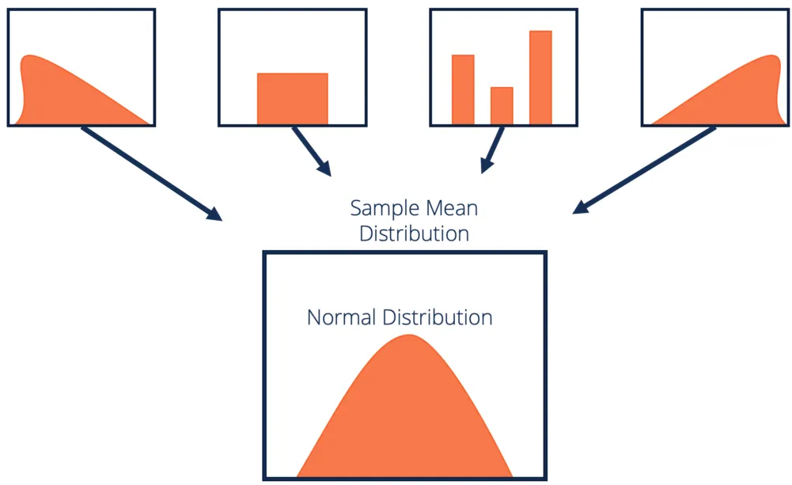

## Summing and averaging of random variables

```{r unif1}
unif=runif(100, min=100, max=200)
hist(unif)

```

## Summing and averaging of random variables

What will be the distribution of means from uniform distribution?
```{r norm1}
mean(runif(100, min=100, max=200))
mean(runif(100, min=100, max=200))
mean(runif(100, min=100, max=200))
mean(runif(100, min=100, max=200))

```

## Summing and averaging of random variables

```{r norm2}
approxnorm=rep(0,1000)
for (i in 1:1000){
  approxnorm[i]=mean(runif(100, min=100, max=200))
}

```

## Summing and averaging of random variables

```{r norm3}
hist(approxnorm)

```

## Summing and averaging of random variables
The averaged variable does not have to come from uniform distribution.
```{r norm4}
approxnormpois=rep(0,1000)
for (i in 1:1000){
  approxnormpois[i]=mean(rpois(100, lambda=150))
}

```

## Summing and averaging of random variables

```{r norm5}
par(mfrow=c(1,2)); hist(approxnorm); hist(approxnormpois)
par(mfrow=c(1,1))

```

## Central Limit Theorem 

If you sum (or average) many random variables (with reasonable properties), this sum will converge to **normal distribution** as the number of random variables grows.   

{width=75%}

## Normal distribution
```{r norm6}
norm=rnorm(100, mean=150, sd=10)
hist(norm, xlim=c(0,200))

```

## Normal distribution

```{r norm7}
normh=rnorm(100, mean=180, sd=10) #higher mean
hist(normh, xlim=c(0,200))

```

## Normal distribution

```{r norm8}
normw=rnorm(100, mean=150, sd=20) #higher variance
hist(normw, xlim=c(0,200))

```

## Normal distribution

Application: The observed height of measured plants is a result of many additive random events that happened during their lifetime. 

## Exercise 1

Does averaging of Bernoulli distribution also result in normal distribution?

## Exercise 2

Normal distribution results from averaging of values drawn for other distributions. Does it also result from addition? And multiplication? Write a script to explore it.

## Lognormal distribution

What if the plant does not grow additively, but by proportion of previous size?

Normal: V1 + V2 + V3 ...

Lognormal: V1 * V2 * V3 ...

log( V1 * V2 * V3 ... ) = log(V1) + log(V2) + log(V3)

log(V1) + log(V2) + log(V3) is normally distributed and log() is a function linking the data with probability distribution

## Exercise 3

Take a multiplicative script from exercise 2 and compare it to lognormal distribution. What is the expected mean of the distribution?