## Grid computation and the stupidest sampler

are stupid cause they waste effort on flat areas

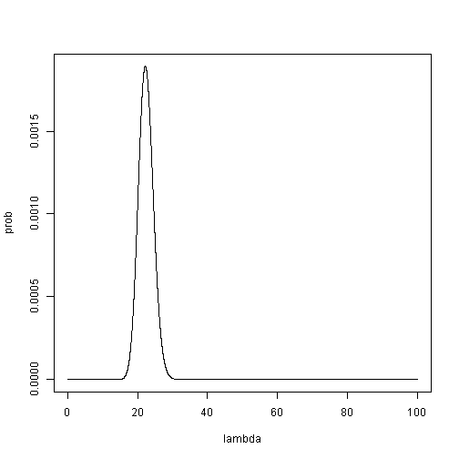{width=50%} 

 
## So what about smarter ways of sampling?

{width=50%} 

## Metropolis - Hastings

If we want to know where the modus is

{width=50%} 

## Metropolis - Hastings

If we want to know where the modus is

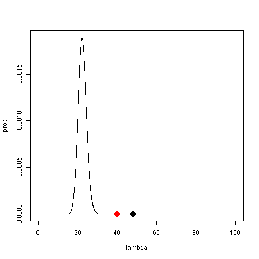{width=50%} 

## Metropolis - Hastings

If we want to know where the modus is

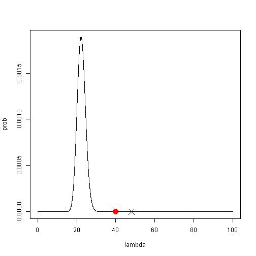{width=50%}  

## Metropolis - Hastings

If we want to know where the modus is

{width=50%}  

## Metropolis - Hastings

If we want to know where the modus is

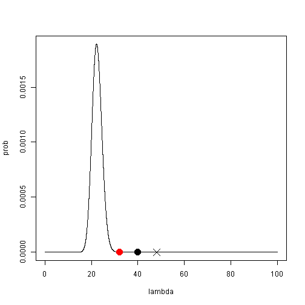{width=50%}  

## Metropolis - Hastings

If we want to know where the modus is

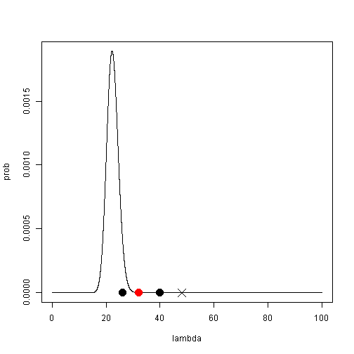{width=50%} 

## Metropolis - Hastings

If we want to know where the modus is, we accept each $\lambda_n$ which satisfies

$$\frac{p(\lambda_n|y) }{ p(\lambda_o|y)}=\frac{p(x|\lambda_n)*p(\lambda_n) }{ p(x|\lambda_o)*p(\lambda_o)}>1$$

## Metropolis - Hastings

If we want to hit each value of $\lambda$ with probability $p(\lambda|y)$, we accept each $\lambda_n$

$$\frac{p(\lambda_n|y) }{ p(\lambda_o|y)}=\frac{p(x|\lambda_n)*p(\lambda_n) }{ p(x|\lambda_o)*p(\lambda_o)}>1$$

with probability 1

## Metropolis - Hastings

and

$$\frac{p(\lambda_n|y) }{ p(\lambda_o|y)}=\frac{p(x|\lambda_n)*p(\lambda_n) }{ p(x|\lambda_o)*p(\lambda_o)}<1$$

with probability $\frac{p(\lambda_n|y) }{ p(\lambda_o|y)}$

## Metropolis - Hastings

And now switch to "histogram thinking"
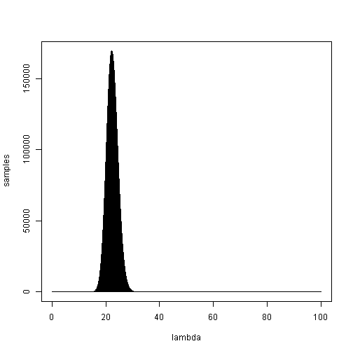{width=50%}

## Metropolis - Hastings

Lets imagine we have more variables than one. For example data from normal distribution and we want to estimate distribution of $\mu$ and $\sigma$.

$$p(\mu, \sigma|y)=\dfrac{p(y|\mu, \sigma)*p(\mu)*p(\sigma)}{p(y)}$$

## Metropolis - Hastings

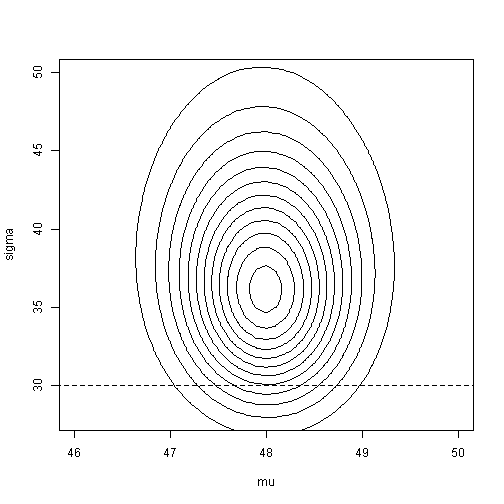{width=50%} 

## Metropolis - Hastings

{width=50%} 

## Metropolis - Hastings

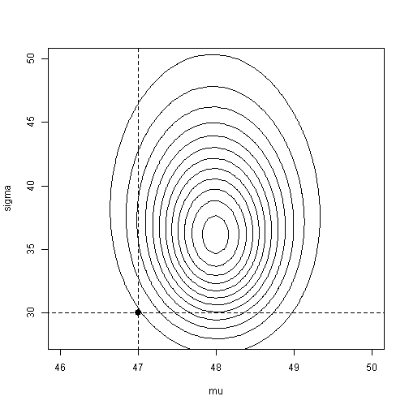{width=50%} 

## Metropolis - Hastings

{width=50%} 

## Metropolis - Hastings

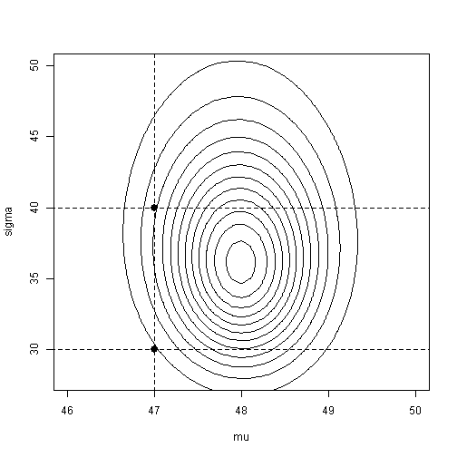{width=50%} 

## Metropolis - Hastings

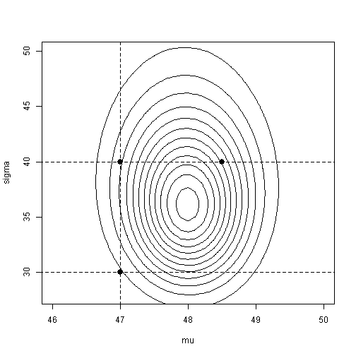{width=50%} 

## Metropolis - Hastings - properties

is more efficient than numerical integration
 

 
## Metropolis - Hastings - properties

problem with camels
 
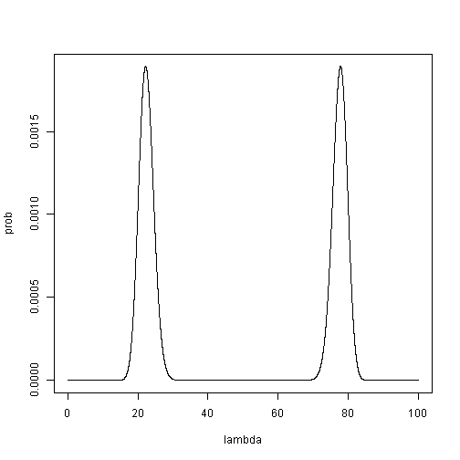{width=50%}  
 
## Metropolis - Hastings - properties

problem with cigars
 
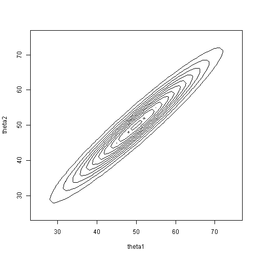{width=50%} 
 
 
 
##  Metropolis - Hastings - properties

need to set up jumps, autocorrelation vs precision trade-off
 
{width=50%} 

##  Metropolis - Hastings - properties

beginning of the sampling does not have information value
 
{width=50%} 

## Hamiltonian Monte Carlo

Proposal steps are not randomly drawn and single dimensional, but follow the dynamics inspired by ball movement in a bowl. 

## Hamiltonian Monte Carlo

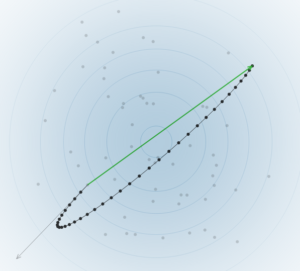{width=50%} 

## Hamiltonian Monte Carlo

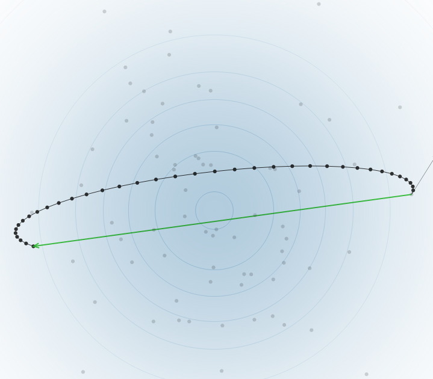{width=50%} 

## Hamiltonian Monte Carlo

https://chi-feng.github.io/mcmc-demo/app.html

## Hamiltonian Monte Carlo - properties

- single step is more demanding than MH
- less autocorrelation than MH
- less problems with cigars

## Exercise 1

Estimate the $\lambda$ posterior using the ulam function from the rethinking package.

