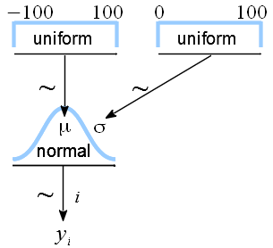

```{r setup, echo=FALSE, warning=F, error=F, message=F}
library(Rlab)
library(rethinking)
set.seed(113)
```

# The rethinking package

The R package for defining Bayesian models  as Directed Acyclic Graphs (DAGs). DAG is a representation of our idea about how the data emerged in the real world, containing deterministic and stochastic processes.



## Model definition

```{r modelstructure}
gaussmodel<-alist(
  #model
  y~dnorm(mu, sigma),
  #priors
  mu~dunif(-100,100),
  sigma~dunif(0,100)
)
```

# t-test example

So let's generate the data. We have ten boys drawn from a normal distribution with $\mu$=160, and ten girls drawn from a normal distribution with $\mu$=140. Both normal distributions have standard deviation 10.

```{r ttest1}
heightgirls=rnorm(10, 140, 10)
heightboys=rnorm(10, 160, 10)
```

This is a typical example of data that can be explored using frequentist t-test.

```{r ttest2}
t.test(heightgirls,heightboys, var.equal=F)
```

The DAG corresponding to t-test would look like this. Translated to natural language we just say that we expect the girl heights to be drawn from a normal distribution with mean $\mu_{girls}$ a variance $\sigma$, and boys from a normal distribution with mean $\mu_{boys}$ and the same standard deviation $\sigma$. (Hey, that's how we simulated the data!) Moreover we say that we have no idea what $\mu_{girls}$ and $\mu_{boys}$ could be, but they are somewhere between 100 and 200, and sigma is between 0 and 100. (A priori expectations about human heights.)

```{r ttest3}
ttestmodel=alist(
  #likelihood
  heightgirls~dnorm(mugirls, sigma),
  heightboys~dnorm(muboys, sigma),
  #priors
  mugirls~dunif(100,200),
  muboys~dunif(100,200),
  sigma~dunif(0,1000)

)
```

Let's now release the Hamiltonian Monte Carlo.

```{r ttest4}

ttestposterior=ulam(ttestmodel,
                    data=list(heightgirls=heightgirls, heightboys=heightboys))

```

Posterior estimates look like this. Neff>200 and Rhat>=1 suggest reasonable convergence.

```{r ttest5}

precis(ttestposterior)

```

We can also plot the results.

```{r ttest6}

plot(ttestposterior)

```

And explore if the chains converged visually. There should not be any trend in the chains and they should resemble the white noise.

```{r ttest7}

traceplot(ttestposterior)

```

Apart from estimating most probable mean values for boys and girls, we can also explore whether these mean values are far enough to assume that boys and girl heights were not drawn from the same distribution. This is a Bayesian equivalent for t-test. To do this, we first need to extract the raw values from HMC chains. 

```{r ttest8}
girlsposterior=extract.samples(ttestposterior)$mugirls
girlsposterior[1:10]
boysposterior=extract.samples(ttestposterior)$muboys
boysposterior[1:10]
```

Cool thing about these chain posteriors is that we can do "intuitive mathematics" with them. So the posterior difference between boy and girls $\mu$s is just the difference between posterior vectors. We can see that this girls-boys difference is very likely not 0, so the boys and girls were drawn from distributions with different $\mu$.

```{r ttest9}
gbdiff=girlsposterior-boysposterior
hist(gbdiff)
```

## Exercise 1

Make heteroskedastic t-test and test if variances differ between the groups.

```{r ttest10}
heightgirlsvar=rnorm(10, 140, 20)
heightboysvar=rnorm(10, 160, 5)
```

## Exercise 2

What happens if we put restrictive priors, e.g. dunif(150,200) for both boys and girls?

# Linear regression

The classical univariate linear regression model is formulated so that the expected value of response variable y is a linear function of predictor variable x. With stochastic component included it means that the observed values of y are a linear function of x with some normally distributed jitter added around. Distributivity of normal distribution also means that we can say y is drawn from normal distributions whose means are defined as a linear function of x. Typically we are interested in estimating the value of parameter $\beta$ from the linear function, when it is away from 0, it means that x values influence values of y. 

$y_{exp}$ = $\alpha$ + $\beta$ * x

y = $\alpha$ + $\beta$ * x + norm( 0, $\sigma$ ) = norm( $\alpha$ + $\beta$ * x, $\sigma$ )


Let's generate the data this way.

```{r regres1}
datareg=data.frame(x=seq(0,10,by=1))
alpha=10
beta=2
sigma=3
datareg$y=rnorm(11,alpha+beta*datareg$x,sigma)
plot(datareg$y~datareg$x)
abline(lm(datareg$y~datareg$x))
```

The model definition is quite similar to t-test. The only new component is the definition of $y_{exp}$ , that is deterministically defined as a linear function f x. Note that "<-" operator stands for deterministic attribution, whereas "~" stands for stochastic attribution.

```{r regres2}
regresmodel=alist(
  #likelihood
  y~dnorm(yexp, sigma),
  yexp <- alpha+beta*x,
  #priors
  alpha~dnorm(0,100),
  beta~dnorm(0,100),
  sigma~dunif(0 , 100)

)
```


Let's run the HMC over the model. 

```{r regres3}
regresposterior=ulam(regresmodel,
                    data=list(x=datareg$x, y=datareg$y))
```

And explore the convergence.

```{r regres4}
precis(regresposterior)
traceplot(regresposterior)
```

For presenting the results of linear regression it is useful to plot the data as a scatterplot, and overlay them with mean posterior estimate of $y_{exp}$ and credibility band. We can use function link() to extract the $y_{exp}$ posterior.

```{r regres5}
yexpregression=link(regresposterior)
dim(yexpregression)

yexpmeanregression=apply(yexpregression,2, mean)
yexpPIregression=apply(yexpregression,2, PI)

plot(datareg$y~datareg$x)
lines(datareg$x , yexpmeanregression)
shade(yexpPIregression , datareg$x)
```

## Exercise 3

Analyze and interpret the t-test data using the linear regression model. What is the relationship between muboys, mugirls, gbdiff, alpha and beta?

## Exercise 4

Make heteroskedastic regression, i.e. morel taking in account that variance is dependent on the predictor. Here are the data.

```{r regres6}
datareghet=data.frame(x=seq(0,10,by=0.5))
alpha=10
beta=5
sigma=3
datareghet$y=rnorm(21,alpha+beta*datareghet$x,sigma*datareghet$x)
plot(datareghet$y~datareghet$x)
```

## Exercise 5
Make regression with two predictors. Here are the data.

```{r regres7}
dataregbipred=data.frame(x1=seq(0,10,by=0.5), x2=sample(seq(0,10,by=0.5),21, replace = F))
alpha=10
beta1=2
beta2=4
sigma=10
dataregbipred$y=rnorm(21,alpha+beta1*dataregbipred$x1+beta2*dataregbipred$x2,sigma)
plot(dataregbipred$y~dataregbipred$x1)
plot(dataregbipred$y~dataregbipred$x2)

```


## Exercise 6
Make regression with two response variables. Here are the data. What is the difference against analyzing both response variables separately? How could we solve it if the stochastic components of y1 and y2 were not independent?

```{r regres8}
dataregbires=data.frame(x=seq(0,10,by=0.5))
alpha=10
beta1=2
beta2=4
sigma=10
dataregbires$y1=rnorm(21,alpha+beta1*dataregbires$x,sigma)
dataregbires$y2=rnorm(21,alpha+beta2*dataregbires$x,sigma)

plot(dataregbires$y1~dataregbires$x)
plot(dataregbires$y2~dataregbires$x)
```

