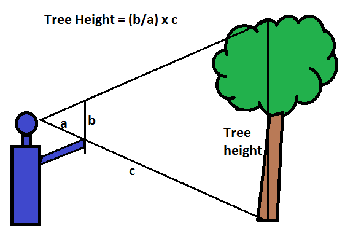

Here we will go through a simple hierarchical model with measurement error.

# Data

Imagine you were asked to measure sizes of the trees in tree avenue going to the lake. We would like to know whether the sizes of the trees increase with humidity. However, trees are difficult to measure. For this reason you have decided to measure every tree multiple times, using the triangulation - it is not precise, but it should give a reasonable idea on how high the trees are. 

{width=30%}
{width=30%}

We can load the data and the rethinking package.

```{r,echo=FALSE, warning=F, error=F, message=F}
load("scdata.RData")
library(rethinking)
```

We can see it is two datasets, one containing all measurements for all trees, another one smaller (we'll talk about it later).

```{r}
scdata
sc1data
```


Let's plot the data in the first dataset, height observations against humidity. we see that there is another problem - it is easy to triangulate from the lake, so the trees in more humid environment were triangulated more times.

```{r}
plot(observed~humidityex,data=scdata)
```


If we ignored everything and fitted a frequentist linear model, this would be significant. Can you say why this approach is wrong?

```{r}
summary(lm(observed~humidityex,data=scdata))
```

# Model

For modeling this system we can use latent variables. These are variables that are important for our thinking about the processes that generated the data, but they are not directly observable. Such as real height of the trees - we only have its estimates using triangulation, but not the exact values. Importantly, each tree can be triangulated with different precision dependent e.g. on shape of its crown.

```{r}
scmodel=alist(
  observed ~ dnorm(realsize[id], sigmam[id]),
  realsize[id] ~ dnorm(mu, sigma),
  mu <- alpha + beta*humidity,

  sigma ~ dunif(0,1000),
  sigmam[id] ~ dunif(0,1000),
  alpha ~ dnorm(0, 100),
  beta ~ dnorm(0,100)

)
```

We can fit the model.

```{r}
scposterior=ulam(scmodel,
                 data=scdata,iter = 5000)
```

Explore the estimates.

```{r}
precis(scposterior)
```
There are multiple levels of parameters.

```{r}
precis(scposterior, depth=2)
```

Explore the convergence.

```{r}
traceplot(scposterior)
```

And plot the mean estimate and credibility lines.

```{r}
yexpsc=link(scposterior)

yexpmeansc=apply(yexpsc,2, mean)
yexpPIsc=apply(yexpsc,2, PI)

plot(observed~humidityex, data=scdata, ylim=c(95,110))
lines(scdata$humidity , yexpmeansc)
shade(yexpPIsc , scdata$humidity)

```

# Complication and example 1

You are a particularly lazy researcher. Instead of triangulating every tree multiple times, you only did it once. How does it change the parameter inference? You can go explore it yourself.

```{r}
sc1data

plot(observed~humidityex, data=scdata, col="red", ylim=c(95,110))
points(observed1~humidity, data=sc1data, col="blue")
```

First one can fit the same model as before.

```{r}
sc1model=alist(
  observed1 ~ dnorm(realsize[id], sigmam[id]),
  realsize[id] ~ dnorm(mu, sigma),
  mu <- alpha + beta*humidity,
  
  sigma ~ dunif(0,1000),
  sigmam[id] ~ dunif(0,1000),
  alpha ~ dnorm(0, 100),
  beta ~ dnorm(0,100)
  
)
```

And fit it.

```{r}
sc1posterior=ulam(sc1model,
                 data=sc1data,iter = 5000)

```

You can see that all the estimates, including alpha and beta, are really poorly estimated. This is because we do not know sigmam values and our data contain almost no information to estimate it. So we do not know how much we can "trust" our points.

```{r}
precis(sc1posterior)
```

```{r}
precis(sc1posterior, depth=2)
```

Also the convergence is not great, especially for sigmas.

```{r}
traceplot(sc1posterior)
```

The parameter imprecision is clearly visible on the predictions of expected real tree height values.

```{r}
yexpsc1=link(sc1posterior)

yexpmeansc1=apply(yexpsc1,2, mean)
yexpPIsc1=apply(yexpsc1,2, PI)

plot(observed1~humidity, data=sc1data, ylim=c(95,110))
lines(sc1data$humidity , yexpmeansc1)
shade(yexpPIsc1 , sc1data$humidity)

```

The prediction lines are completely out of the data.

```{r}
plot(observed1~humidity,ylim=c(0,200), data=sc1data)
lines(sc1data$humidity , yexpmeansc1)
shade(yexpPIsc1 , sc1data$humidity)

```


# Solution and example 2

OK, so we don't have enough data to estimate all sigmam values. Perhaps we can help ourselves by assuming that all the sigmam values are the same. 

```{r}
sc1ssmodel=alist(
  observed1 ~ dnorm(realsize[id], sigmam),
  realsize[id] ~ dnorm(mu, sigma),
  mu <- alpha + beta*humidity,
  
  sigma ~ dunif(0,1000),
  sigmam ~ dunif(0,1000),
  alpha ~ dnorm(0, 100),
  beta ~ dnorm(0,100)
  
)
```

And fit it.

```{r}
sc1ssposterior=ulam(sc1ssmodel,
                 data=sc1data,iter = 5000)

```

We see that the precision of estimates improved dramatically.

```{r}
precis(sc1ssposterior) # single sigmam
precis(sc1posterior) # multiple sigmam
```

```{r}
yexpsc1ss=link(sc1ssposterior)

yexpmeansc1ss=apply(yexpsc1ss,2, mean)
yexpPIsc1ss=apply(yexpsc1ss,2, PI)

plot(observed1~humidity, data=sc1data, ylim=c(95,110))
lines(sc1data$humidity , yexpmeansc1ss)
shade(yexpPIsc1ss , sc1data$humidity)

```

# Solution and example 3

Alternatively, we can also directly advise the model on our prior expectation what sigmam is. For instance we know based on previous experience that it is between 1 and 3.

```{r}
sc1rpmodel=alist(
  observed1 ~ dnorm(realsize[id], sigmam[id]),
  realsize[id] ~ dnorm(mu, sigma),
  mu <- alpha + beta*humidity,
  
  sigma ~ dunif(0,1000),
  sigmam[id] ~ dunif(1,3),
  alpha ~ dnorm(0, 100),
  beta ~ dnorm(0,100)
  
)
```

And fit it.

```{r}
sc1rpposterior=ulam(sc1rpmodel,
                 data=sc1data,iter = 5000)

```

We see that the precision of estimates improved even more.

```{r}
precis(sc1rpposterior) # restrictive prior
precis(sc1ssposterior) # single sigmam
precis(sc1posterior) # multiple sigmam
```

```{r}
yexpsc1rp=link(sc1rpposterior)

yexpmeansc1rp=apply(yexpsc1rp,2, mean)
yexpPIsc1rp=apply(yexpsc1rp,2, PI)

plot(observed1~humidity, data=sc1data,ylim=c(95,110))
lines(sc1data$humidity , yexpmeansc1rp)
shade(yexpPIsc1rp , sc1data$humidity)

```


# Trick question
What if we wanted to hardwire sigmam to 2?

# Lesson to learn
# No replacement for ~~displacement~~ amount of data


The less sophisticated model with a lot of data may simply perform better. But not much better in fact. 


```{r}
plot(observed~humidityex, data=scdata, col="red", ylim=c(95,110))
points(observed1~humidity, data=sc1data, col="blue")

lines(scdata$humidity , yexpmeansc, col="red")
shade(yexpPIsc , scdata$humidity, col=alpha("red", alpha=0.3))

lines(sc1data$humidity , yexpmeansc1ss, col="blue")
shade(yexpPIsc1ss , sc1data$humidity, col=alpha("blue", alpha=0.3))

```
