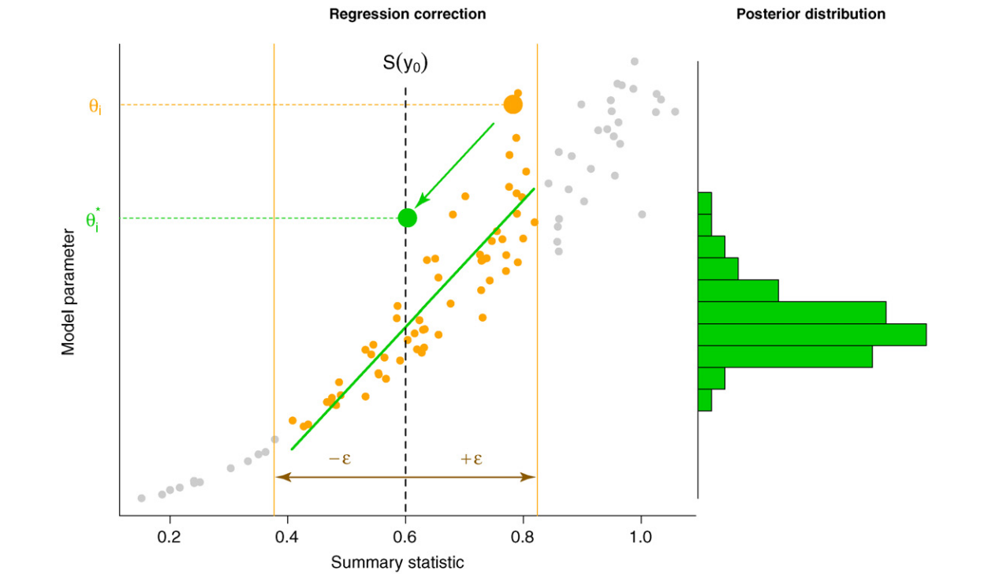

All Bayesian methods are based on Bayes rule:

$p(\theta|x) = \frac {p(\theta) \times p(x|\theta)}{p(x)}$

where

$p(x|\theta)$ ... likelihood

$p(\theta)$ ... prior

$p(\theta|x)$ ... posterior

$p(x)$ ... ~~the horrible thing~~


The MCMC samplers are great for avoiding horrible things. However, to use them, one still needs to have the likelihood function. Sometimes we may find ourselves in the situation when we cannot express $p(x|\theta)$, but we can still simulate expected values of x using values of $\theta$. 

The Approximate Bayesian Population is based on the idea that we simulate x values using some prior distribution of $\theta$ and use a meaningful summary statistic s() to transform x. Then we select simulation runs where s($x_{obs}$)-s($x_{sim}$) < tol. It is possible to prove that if we decrease tol -> 0, the $\theta$ values of selected simulation runs converge to the posterior. 


# Simple example with normal distribution

Lets first look at the problem with 20 data points drawn from normal distribution. We are interested in estimating $\mu$ and $\sigma$. This is our observed data. We extract median and range from them, which are our summary statistics.

```{r}
set.seed(13)
abctargetdata=rnorm(20, 52, 4)
abctargetdata
abctarget=c(median(abctargetdata), range(abctargetdata)[1]-range(abctargetdata)[2])

```


Our model takes values of $\mu$ and $\sigma$ and produces the sets of 20 datapoints from normal distribution with these parameters. From these it calculates median and range, which are our summary statistics.

```{r}
abcmodel=function(mu, sigma){
  temp=rnorm(20, mu, sigma)
  ret=c(median(temp),range(temp)[1]-range(temp)[2])
  return(ret)
}
```

These are our priors:

```{r}
abcprior=data.frame(mu=runif(10000,0,100), sigma=runif(10000,0,10))
hist(abcprior$mu, breaks = seq(0,100,1))
hist(abcprior$sigma, breaks = seq(0,10,0.1))
```

Lets simulate the data based on priors:

```{r}
abcsummarystats=t(mapply(abcmodel, mu=abcprior$mu, sigma=abcprior$sigma))
abcsummarystats[1:10,]

```

The abc function does not do anything difficult, it just draws the simulated data that are close to the observed target dataset.

```{r}
library(abc)
abcposter=abc(target=abctarget, param=abcprior, sumstat=abcsummarystats, tol=.1, method =
      "rejection")
abcposter$unadj.values[1:10,]

```

Our estimation works reasonably for $\mu$.

```{r}
hist(abcprior$mu, breaks = seq(0,100,1), main="",xlab="sigma")
hist(abcposter$unadj.values[,1], add=T, col="red", breaks=seq(0,100,1))
abline(v=52,lwd=3, lty=2)
```

Not so much for $\sigma$

```{r}
hist(abcprior$sigma, breaks = seq(0,10,0.1), main="",xlab="sigma")
hist(abcposter$unadj.values[,2], add=T, col="red", breaks=seq(0,10,0.1))
abline(v=4,lwd=3, lty=2)
```

# Hubbells Neutral Theory of Biodiversity

OK, so far we could easily express the likelihood and use ulam for much more efficient estimation. But what if we have model for which we cannot express the likelihood. For example we have an observation of community though time and we would like to know to which turnover value p of Hubbell's Neutral Theory values it does correspond the best.

```{r}
library(untb)
set.seed(13)
target <- untb(start=rep(1,100),prob=0.8, gens=50,keep=TRUE)
target[1:10,]
```

It might be more reasonable to look ad the biodiversity curve through time, rather than abundances of individual species. Species count is our summary statistic s(). 

```{r}
target.curve <- species.count(target)

plot(1:length(target.curve),target.curve, type="l",lwd=3,xlab="t", ylab="richness")
```

We can simulate our apriori expectation of p .

```{r}
untbprior=runif(10000, 0,1)

```

And use it for generating diversity curve using untb simulator.

```{r}
untb.streamlinedcurve=function(p){
  a=untb(start=rep(1,100),prob=p, gens=50,keep=TRUE)
  return(species.count(a))
}

untbsummarystatscurve=t(mapply(untb.streamlinedcurve, p=untbprior))

```

We again use the abc function for selecting simulations close to the target statistic based on observed data

```{r}
untbpostercurve=abc(target=target.curve, param=untbprior, sumstat=untbsummarystatscurve, tol=.1, method =
                "rejection")
```

We can compare the selected posterior p to the prior.

```{r}
hist(untbprior, seq(0,1,0.01), main="",xlab="p")
hist(untbpostercurve$unadj.values, seq(0,1,0.01), col="red", add=T)
abline(v=0.8,lwd=3, lty=2)
```

And we can also visualize the diversity curves that were selected as closest to the target.

```{r}
library(scales)
plot(1:length(target.curve),target.curve, type="l",lwd=3, xlab="t", ylab="richness")
for (i in 1:length(untbsummarystatscurve[,1])){
  lines(1:length(target.curve),untbsummarystatscurve[i,], type="l",col=alpha("blue",0.01))
}
for (i in 1:length(untbpostercurve$ss[,1])){
  lines(1:length(target.curve),untbpostercurve$ss[i,], type="l",col=alpha("black",0.01))
}

```


# Exercise 1

So far we were using the whole diversity curve as a summary statistic. What if we were only using diversity at the end of the simulation?

```{r}

target.fin=target.curve[length(target.curve)]
untbsummarystatsfin=untbsummarystatscurve[,length(target.curve)]

```


# Exercise 2

And what about diversity in generation 3 of the simulation?

```{r}

target.fin=target.curve[3]
untbsummarystatsfin=untbsummarystatscurve[,3]

```

# Exercise 3 

There are other methods for estimating the abc posterior. Typically they are based on correcting the posterior using various local regression methods. Try to refit the data with these methods.



# Exercise 4

One can also compare different models using postpr function, using the estimate of Bayes factor. Simulate the first example from Poisson distribution and compare to normal.

# Exercise 5

Refit the simple example with normal distribution with the other methods. Then compare it with the ulam model.
